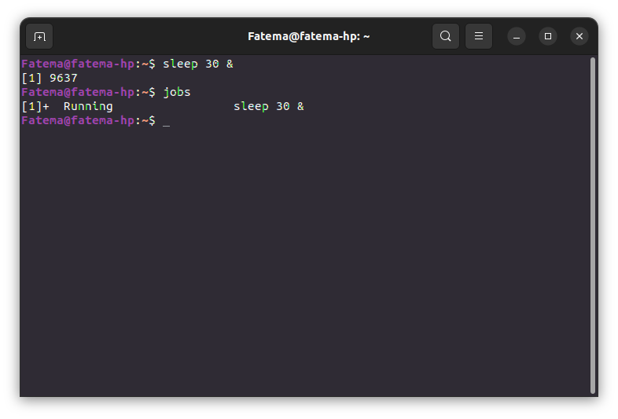
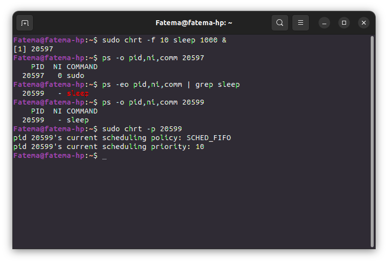

# Linux Processes Commands Exercises

**Beginner Level**
1. List all running processes
```bash
ps aux
```


2. Monitor system processes in real-time
```bash
top
```


3. Start a background process
```bash
sleep 30 &
jobs
ps
```
  

4. Bring a background process to the foreground
```bash
fg
```
 

5. Suspend and resume a process
```bash
ping google.com
`Ctrl+Z`
fg
bg
```
 


**Intermediate Level**
6. Kill a process by PID
```bash
sleep 300 &
pgrep --full sleep
kill 11530
```
 

7. Terminate multiple processes
```bash
sleep 100 &
sleep 200 &
sleep 300 &
pkill sleep
```
 

8. Niceness levels
```bash
nice -n 10 sleep 1000 &
ps -o pid,ni,comm 13151
sudo renice -n 5 -p 13151
ps -o pid,ni,comm 13151
```


9. View process hierarchy
```bash
pstree
```


10. Redirect process output
```bash
ping google.com >> ~/Downloads/files.txt
```
[files.txt](https://drive.google.com/file/d/1gtrxCiymFvCbYsbbI-BuZfaGLbxc9Y4P/view?usp=drive_link)


**Advanced Level**
11. Track system calls of a process
```bash
strace ls
```


12. Monitor file descriptors
```bash
cat &
lsof -p 19879
```


13. Process scheduling policies
```bash
sudo chrt -f 10 sleep 1000 &
ps -o pd,ni,comm 20597
ps -eo pd,ni,comm | grep sleep
ps -o pd,ni,comm 20599
sudo chrt -p 20599
pstree
```
  

14. Create and terminate a zombie process

```bash
ps aux | grep Z
ps aux| grep zombie
kill 22679
```
  

15. Limit resource usage
```bash
ulimit -t 10 dd if=/dev/zero of=/dev/null
ulimit -a
```


**Assignment**
1- Check how many cores do you have using top command.


2- Create number of cores + 2 processes run in background.


3- Change priority for them:
Monitor them using top command, did you notice any change ?
  
  
`when ni value changed, Pr changed to with shift +20`

4- Kill them all using killall command.
    
