# Linux File System Commands Exercises

**Basic Navigation**

1. Use `ls` to list all files and directories in the current directory.
```bash
ls
```

2. Use `cd` to navigate to a specific directory.
```bash
cd Desktop/
```

3. Use `pwd` to print the current working directory.
```bash
pwd
```
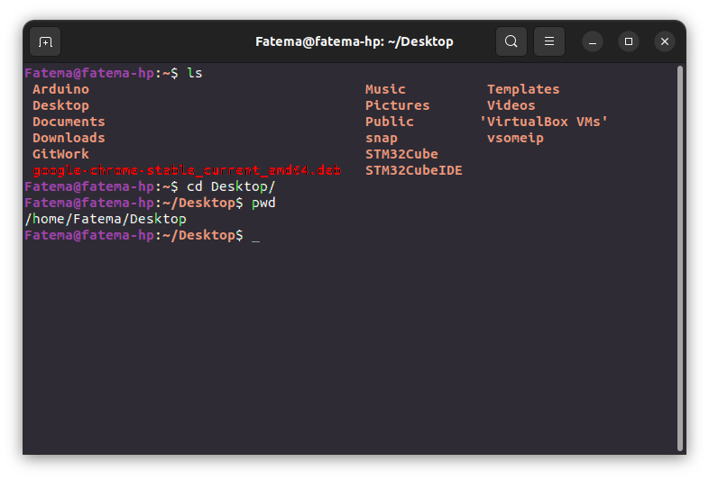


**File and Directory Operations**

4. Create a directory named “practice” in the current directory using `mkdir`.
```bash
mkdir practice
```

5. Create an empty file named “file.txt” within the “practice” directory using `touch`.
```bash
cd practice/
touch file.txt
```

6. Copy “file.txt” to a new file “file_backup.txt” using `cp`.
```bash
vim file.txt 
touch file_backup.txt
cp file.txt file_backup.txt 
```

7. Move “file_backup.txt” to another directory using `mv`.
```bash
mv file_backup.txt ~/Desktop/Embedded\ Linux/Diploma/Task_5/
```

8. Rename “file.txt” to “new_file.txt” using `mv`.
```bash
mv file.txt new_file,txt
```

9. Delete the “new_file.txt” using `rm`.
```bash
rm file_backup.txt 
```
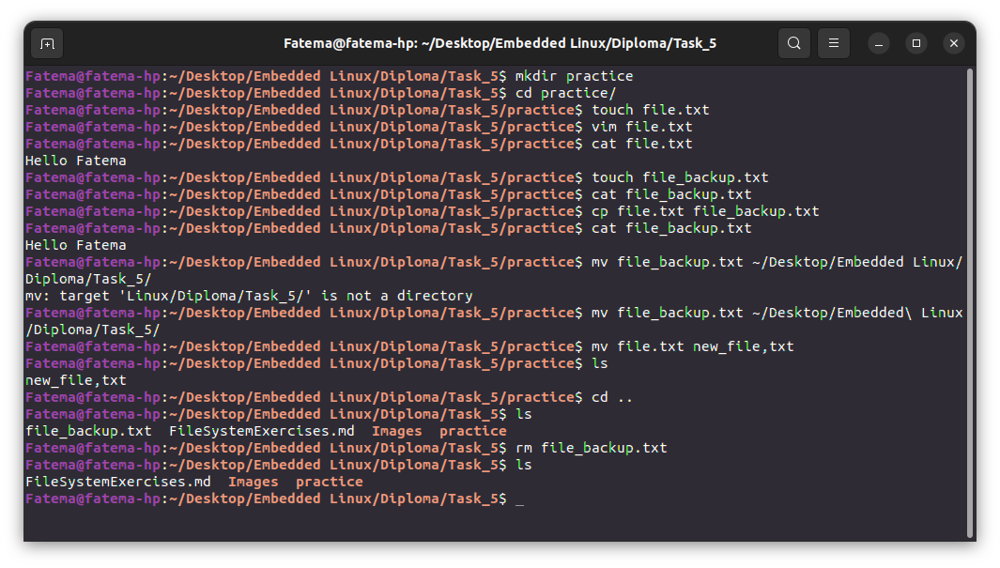


**File Viewing and Editing**

10. Create a text file using `echo` or a text editor like `nano`. 
```bash
nano file.txt
```

11. View the contents of the file using `cat`. 
```bash
cat file.txt 
```

12. View the contents of the file using `less`. 
```bash
less file.txt 
```
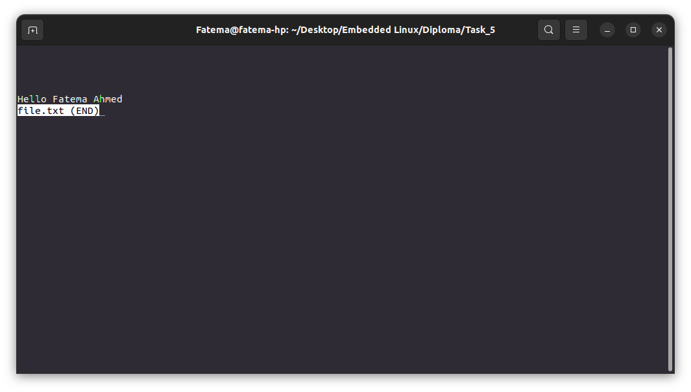

13. Edit the file using `nano` or another text editor.
```bash
nano file.txt 
```
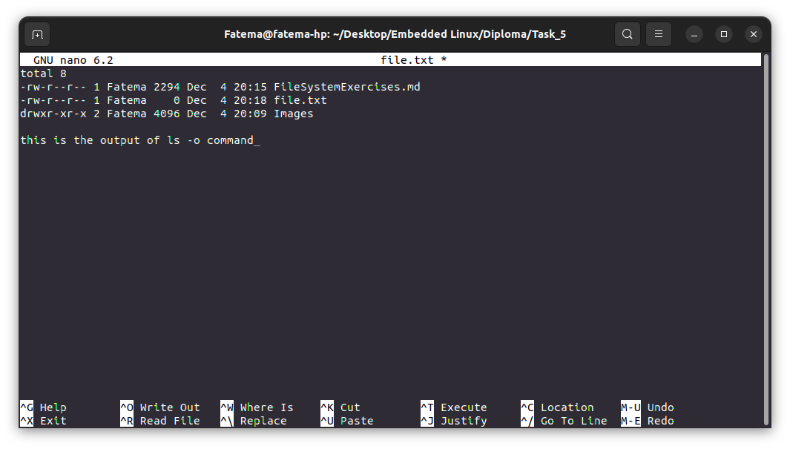

14. Redirect the output of a command (e.g., ls) to a file using `>`.
```bash
ls -o > file.txt 
cat file.txt 
```
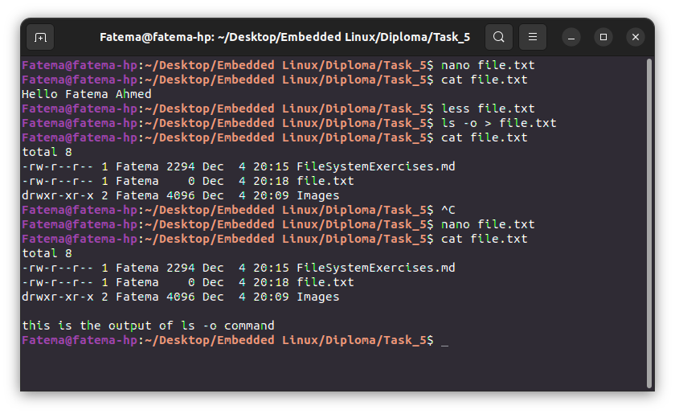
 

**File Permissions**

15. Create a file and set specific permissions using `chmod`. 
```bash
touch file.txt
chmod u+x file.txt 
chmod u-w file.txt 
```

16. Check the permissions of the file using `ls -o`. 
```bash
ls -o
```
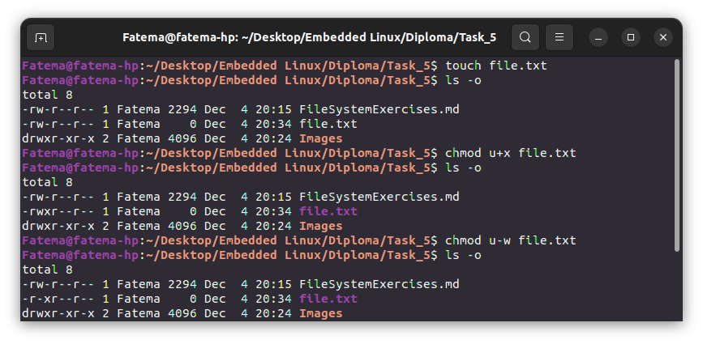

17. Change the owner and group of the file using chown and verify the changes using `ls -l`.
to Know Users
```bash
cut -d: -f1 /etc/passwd
```
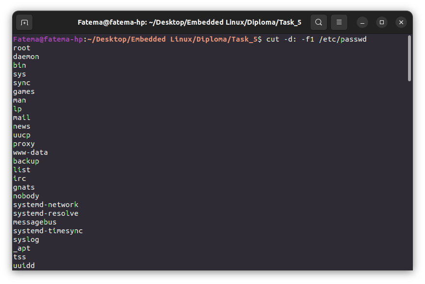

to Know Groups
```bash
cut -d: -f1 /etc/group
```
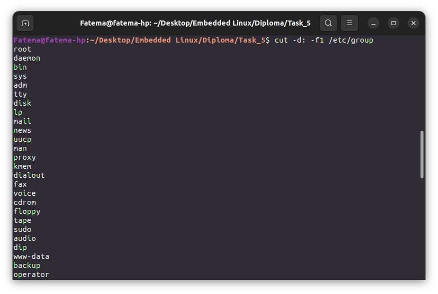

to Change the Owner and Group
```bash
sudo chown bin:bin file.txt
ls -l
```
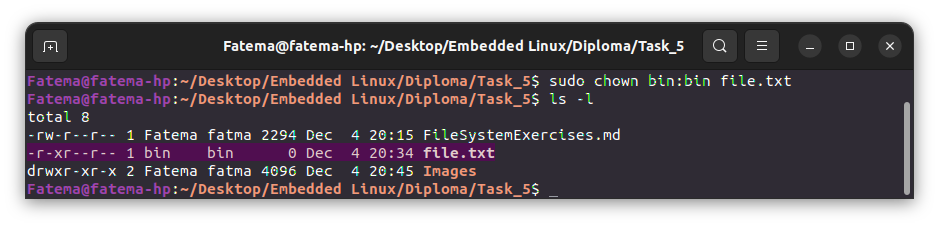


**User and Group Management**

18. Create a new user using `useradd`.
```bash
sudo useradd Bullet
```

19. Set a password for the new user using `passwd`.
```bash
sudo passwd Bullet
``` 
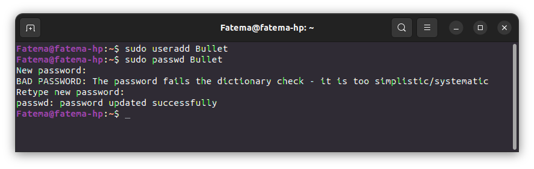

20. Create a new group using `groupadd`.
```bash
sudo groupadd BulletGroup
```

21. Add the user to the newly created group using `usermod`.
```bash
sudo usermod -a -G BulletGroup Bullet
groups Bullet
```

 

**Process Management**

22. List all processes using `ps`.
```bash
ps
```
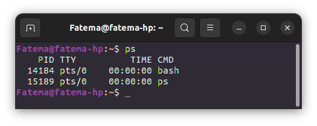

23. List processes in real-time using `top`. 
```bash
top
```
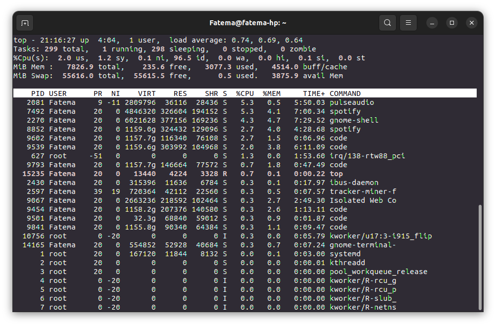

24. Find a specific process using `pgrep`. 
```bash
pgrep firefox
```


25. Terminate a process using `kill`.
```bash
kill firefox
```
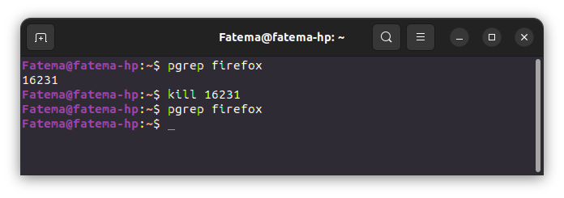
 

**File Searching**

26. Use `find` to search for a specific file or directory. 
27. Use `grep` to search for a specific string in a file.
```bash
find ~ -name "file.txt"
grep -F "line" /home/Fatema/file.txt
```
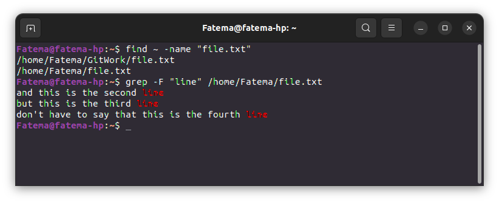

