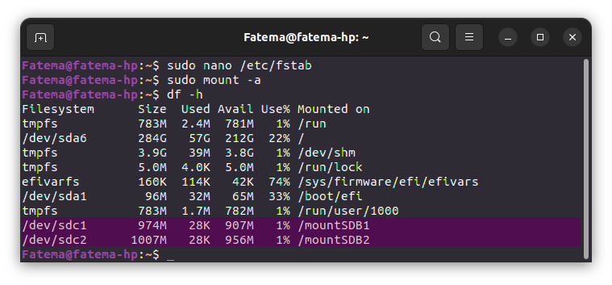

# Make Partitions on SD Card

1. Make at least two partitions on your SD-CARD using gparted.
2. Create for each partitions filesystem ( first one ext4 & second one ext2 ).
3. Mount two partitions on your root filesystem.
3. Add some files inside each one.
4. reboot your machine.
5. check if mounting points still exists, it should not.
6. Make the ext4 persistance by adding /etc/fstab file —-> (search how you can do that).
7. reboot your system.
8. Check if the ext4 is mounted.

**Steps**
- Monitor Block Disk.
```bash
lsblk
```


- `unmount` the device partitions.
```bash
umount /dev/sdb1
```
  

- Start the Partitioning.
```bash
sudo fdisk /dev/sdb1
```
Delete old Partitions


Create 2 Primary Partitions


Write changes and save


```bash
lsblk
```


- Create for each partitions filesystem (first one ext4 & second one ext2).
```bash
sudo mkfs -t ext4 /dev/sdb1
sudo mkfs /dev/sdb2
```


- `mount` the partitions on root filesystem.
```bash
sudo mkdir /mountSDB1
sudo mkdir /mountSDB2
sudo mount -t ext4 /dev/sdb1 /mountSDB1
sudo mount -t ext2 /dev/sdb2 /mountSDB2
lsblk
```
  

- Add files inside each one.
```bash
sudo cp file1.txt /mountSDB1
sudo cp file2.txt /mountSDB2
ls /mountSDB1
ls /mountSDB2
```


- Mounting points doesn't exists.


-  Adding `/etc/fstab` file 
```bash
sudo blkid /dev/sdc1
sudo blkid /dev/sdc2
```
/dev/sdc1: UUID="97c3f930-c7ba-4d52-bb77-6933dffbf42b" BLOCK_SIZE="4096" TYPE="ext4" PARTUUID="ba7ab280-01"
/dev/sdc2: UUID="8bcc9cda-d03f-4964-b41f-097a3dd6aeda" BLOCK_SIZE="4096" TYPE="ext2" PARTUUID="ba7ab280-02"


```bash
umount /dev/sdc1
sudo mount -t ext4 /dev/sdc1 /mountSDB1
umount /dev/sdc2
sudo mount -t ext2 /dev/sdc2 /mountSDB2
sudo blkid /dev/sdc1
```


```bash
sudo nano /etc/fstab
```


```bash
sudo mount -a
df -h
```
`sudo mount -a` returns nothing `Everything is correct`


- Mounting points still exists.


