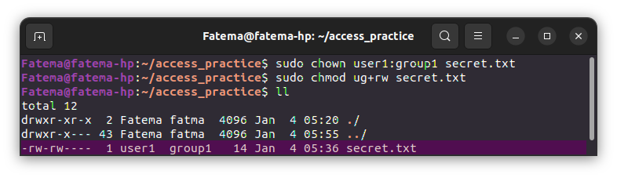
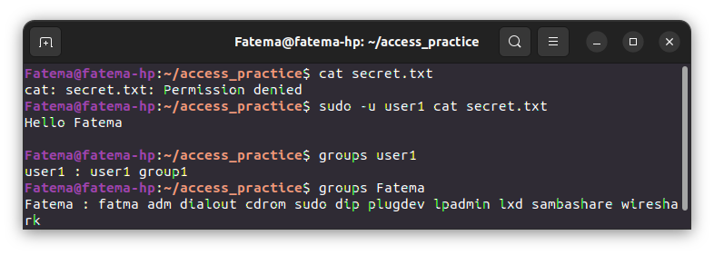

# Linux File System Commands Exercises

## Exercise 1 ## 
### File Permissions and Ownership ###
1- Create a directory called access_practice.
2- Inside the directory, create a file named secret.txt.
```bash
mkdir access_practice
cd access_practice/
touch secret.txt
```


3- Set the file permissions to allow read and write access for the owner, and no access for group and others.
```bash
chmod go-r secret.txt 
```


4- Change the ownership of the file to a different user.
```bash
 chown games secret.txt
```


5- Try accessing the file from the original and the different user accounts to observe the access permissions in action.
```bash
sudo -u Fatema cat secret.txt
sudo -u games cat secret.txt
```


## Exercise 2 ## 
### User and Group Management ###
1- Create a new user named user1.

2- Create a new group named group1.

3- Add user1 to group1.
```bash
sudo useradd user1
sudo groupadd group1
sudo usermod -aG group1 user1
```

4- Change the ownership of secret.txt to user1 and group1.

5- Set the file permissions to allow read and write access for the owner and the group.
```bash
sudo chown user1:group1 secret.txt
sudo chmod ug+rw secret.txt
```


6- Test accessing the file both as user1 and a different user to understand group-based access control.
```bash
cat secret.txt
sudo -u user1 cat secret.txt
groups user1
groups Fatema
```

