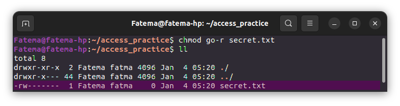

# Linux File System Commands Exercises

## Exercise 1 ## 
### File Permissions and Ownership ###
1- Create a directory called access_practice.
2- Inside the directory, create a file named secret.txt.
```bash
mkdir access_practice
cd access_practice/
touch secret.txt
```


3- Set the file permissions to allow read and write access for the owner, and no access for group and others.
```bash
chmod go-r secret.txt 
```


4- Change the ownership of the file to a different user.
```bash
 chown games secret.txt
```


5- Try accessing the file from the original and the different user accounts to observe the access permissions in action.
```bash
sudo -u Fatema cat secret.txt
sudo -u games cat secret.txt
```


## Exercise 2 ## 
### User and Group Management ###
